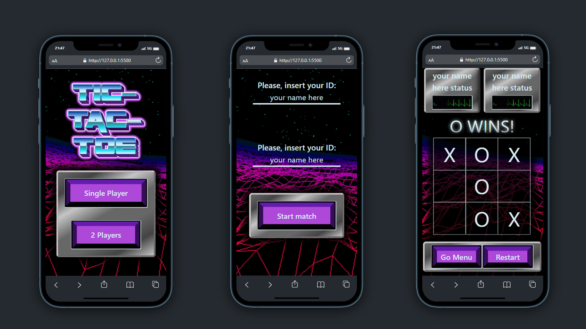

# Bienvenido a mi proyecto de tres en raya

  
Contenido 📝

  <ol>
    <li><a href="#objetivo-🎯">Objetivo</a></li>
    <li><a href="#sobre-el-proyecto-🔎">Sobre el proyecto</a></li>
    <li><a href="#deploy-🚀">Deploy</a></li>
    <li><a href="#stack">Stack</a></li>
    <li><a href="#vistas">Vistas</a></li>
    <li><a href="#futuras-funcionalidades">Futuras funcionalidades</a></li>
    <li><a href="#webgrafia">Webgrafia</a></li>
    <li><a href="#contacto">Contacto</a></li>
  </ol>

## Objetivo 🎯

El objetivo de este proyecto es practicar el uso de Javascript.

## Sobre el proyecto 🔎

Es un juego de tres en raya en el que se puede escoger jugar contra la CPU o contra otro jugador. También se le pregunta al jugador por su nickname y queda guardado en el session storage. Cada jugador tiene 3 fichas y gana el primero en conseguir alinearlas.

## Deploy 🚀

    <a href="https://adrip01.github.io/TicTacToe/">⭐🌟⭐<strong>Url a producción </strong></a>⭐🌟⭐

## Stack

    
    
    

 

## Vistas

Vistas en móvil

## Futuras funcionalidades

✅ Guardado de nombre en el session storage
⬜ Limitación a tres fichas por jugador  
⬜ Implementar juego contra CPU

<!-- ⬜ ... -->

## Webgrafia:

Para conseguir mi objetivo he recopilado información de:

- https://developer.mozilla.org/en-US/
- https://www.w3schools.com/js/default.asp
- https://getbootstrap.com/docs/5.2/getting-started/introduction/

## Contacto

